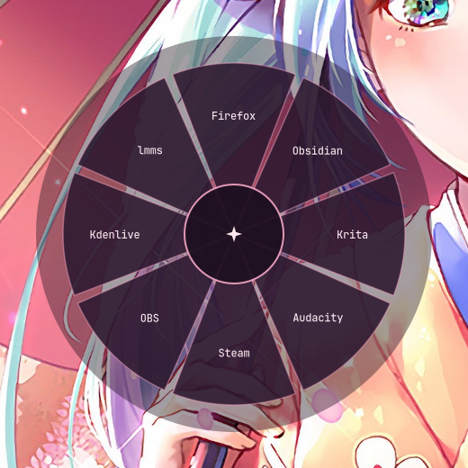
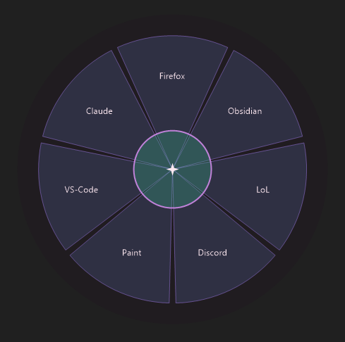

# pie-menu ✦

<p align="center">
  
</p>


<p align="center">
  
</p>


A pink princess radial app launcher. Hold <kbd>Super</kbd>, tap <kbd>Tab</kbd> →
a pie of eight app slices blooms at your cursor. Glide onto a slice, release
<kbd>Super</kbd> (or click) to launch. <kbd>Esc</kbd> cancels. Multi-monitor
aware — the pie opens on whichever screen your mouse is on.

Two implementations, same look and feel:

| | Linux (`linux/`) | Windows (`windows/`) |
|---|---|---|
| Stack | Python + GTK3 + gtk-layer-shell + Cairo | AutoHotkey v2 + GDI+ |
| Trigger | Super+Tab (compositor keybind) | Win+Tab (replaces Task View while running) |
| Works on | any Wayland compositor with layer-shell: Hyprland, sway/wlroots, KDE Plasma | Windows 10/11 |
| Tested on | Arch Linux + Hyprland | Windows 10 |

## Linux setup

Needs a Wayland compositor that supports the layer-shell protocol — that's
Hyprland, sway and the other wlroots compositors, and KDE Plasma (KWin).
X11 sessions are not supported.

Dependencies: GTK3, gtk-layer-shell, and PyGObject:

- Arch: `pacman -S python-gobject gtk3 gtk-layer-shell`
- Debian/Ubuntu: `apt install python3-gi gir1.2-gtk-3.0 gir1.2-gtklayershell-0.1`
- Fedora: `dnf install python3-gobject gtk3 gtk-layer-shell`

```sh
install -m 755 linux/pie-menu ~/.local/bin/pie-menu
mkdir -p ~/.config/pie-menu
cp linux/config.example.ini ~/.config/pie-menu/config.ini   # optional, see Customizing
```

Then bind a key to the script in your compositor:

- **Hyprland**: `bind = SUPER, Tab, exec, ~/.local/bin/pie-menu`
- **KDE Plasma**: System Settings → Keyboard → Shortcuts → Add New → Command,
  command `~/.local/bin/pie-menu`, assign Meta+Tab (or whatever you like)
- **sway**: `bindsym $mod+Tab exec ~/.local/bin/pie-menu`

**How the pie finds your cursor:** on Hyprland it asks `hyprctl` and opens
exactly at the pointer. On KDE it does the same via
[kdotool](https://github.com/jinliu/kdotool) if that's installed (recommended,
it's in the AUR/cargo). Without either, it relies on the compositor reporting
the pointer to the overlay: the pie appears at the cursor as soon as the
pointer moves at all, or centered on the primary monitor if it stays still.

## Windows setup

See [`windows/README.md`](windows/README.md) — short version: install
[AutoHotkey v2](https://www.autohotkey.com), fix the app paths in
`pie-menu.ini`, double-click `PieMenu.ahk`.

## Customizing

No code editing needed — both versions read the same INI config format:

| | Config location |
|---|---|
| Linux | `~/.config/pie-menu/config.ini` ([example](linux/config.example.ini)) |
| Windows | `pie-menu.ini` next to the script |

Three sections, all optional (missing file or keys = built-in defaults):

- **`[apps]`** — `Display Name = command`, one per slice, clockwise from the
  top. Put *your* programs here — any number of slices works, the angles
  adapt automatically.
- **`[colors]`** — `#RRGGBB` or `#RRGGBBAA` for every element (slices, hover,
  borders, text, center, overlay). Pink princess by default (`#f4a7c3` pink,
  `#fde8f0` blush, `#1e1020` plum), but it's your pie: gothify, nordify,
  gruvboxify at will.
- **`[menu]`** — radii, gap between slices, font.

The example configs are fully commented and list every key with its default.

## License

MIT — see [LICENSE](LICENSE).
